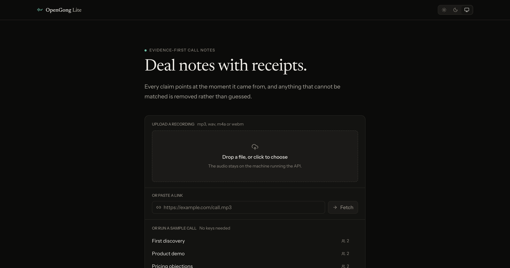
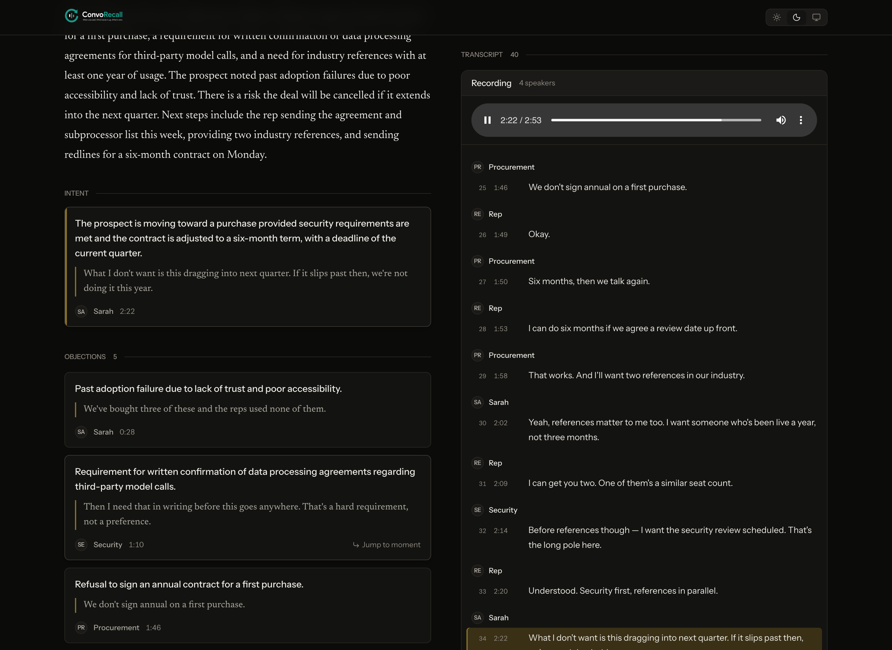
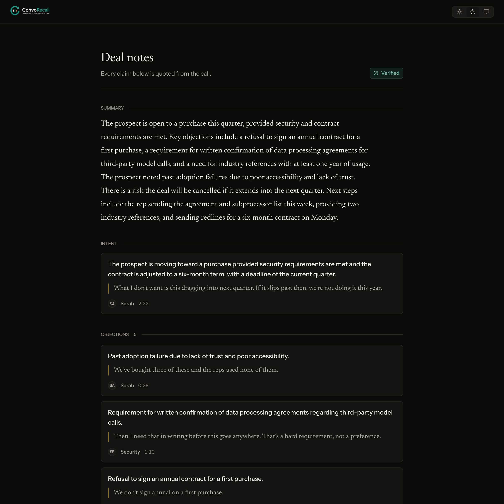
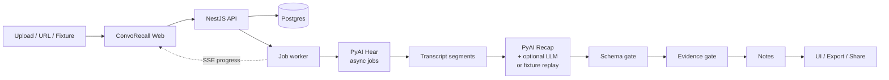
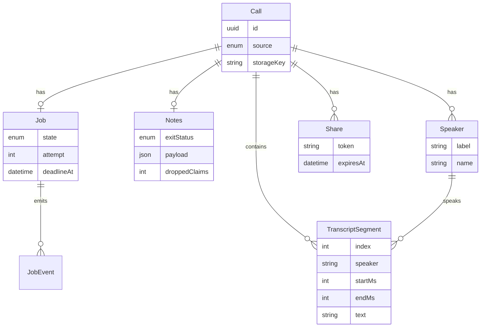

<p align="center">
  
</p>

<h1 align="center">ConvoRecall</h1>

<p align="center">
  <strong>What was said. What backs it up. What’s next.</strong>
</p>

<p align="center">
  Upload a sales call or meeting. Get a diarized transcript and deal notes where every
  claim points back to the exact line that proves it — or the claim does not ship.
</p>

<p align="center">
  
  
  
  
  
  
  
  <a href="#the-hacksmiths"></a>
</p>

> **Alpha (v0.1.0).** The upload → transcript → notes → export/share path works locally.
> There is **no authentication**, **no retention policy**, and **no multi-tenancy**.
> Do not expose this to the public internet with real customer calls yet.
> See [PROJECT_STATE.md](PROJECT_STATE.md).

---

## Demo

| Start | Notes with receipts | Share |
|-------|---------------------|-------|
|  |  |  |

**Try it offline in under five minutes** (no API keys required for sample calls):

```bash
pnpm install && pnpm setup && pnpm seed && pnpm dev
```

Open [http://localhost:3000](http://localhost:3000) → pick a sample call → click a claim → the
transcript scrolls to the cited line and the recording seeks to the moment it was said.

Full rehearsal script: [docs/Demo.md](docs/Demo.md).

---

## What is ConvoRecall?

ConvoRecall turns raw sales conversations into **structured, checkable intelligence** —
what was said, what backs each claim, and what’s next.

Teams record hours of calls. Almost nobody re-listens. Buying signals, objections, and
commitments disappear into a file. ConvoRecall:

1. Accepts an upload, a URL, or a sample fixture
2. Transcribes with **speaker diarization** via [PyAI Hear](https://pyai.com)
3. Analyses the transcript with **PyAI Recap** — the same vendor, so the default build
   runs on **one API** ([`LLM_ENABLED=false`](#the-llm-toggle))
4. Ships only claims that pass a **schema gate** and an **evidence gate**
5. Lets you export Markdown/JSON or hand someone a read-only share link

An OpenAI-compatible LLM is **optional** and additive — turn it on and it fills what Recap
cannot evidence. See [the LLM toggle](#the-llm-toggle).

Shipped note sections today:

| Section | Cited? | Description |
|---------|--------|-------------|
| **Summary** | derived | What happened, synthesized from surviving claims only |
| **Intent** | ✅ quote | Buyer intent, or `null` when nothing survived |
| **Objections** | ✅ quote | Pushback, each with a transcript quote and timestamp |
| **Decisions** | ⚠️ uncited | What the call settled, as Recap reports it — no quote attached |
| **Next steps** | ✅ quote + ⚠️ uncited | Commitments with receipts; Recap’s quoteless action items appear here too when nothing cited covers them |
| **Follow-up email** | derived | Draft built from surviving claims, greeted only when the recipient is provable |

**Cited and uncited are visually distinct and never mixed.** An uncited item has no marker
rail, no timestamp and nothing to click, because there is nowhere to click to. Uncited is
not the same as unverified — see [known limits](#known-limits).

> **Not in this release:** live microphone streaming, sentiment scoring, meeting search,
> CRM sync, or team analytics dashboards. See [Roadmap](#roadmap).

---

## Why ConvoRecall?

### The problem

Sales conversations contain the deal — buying signals, objections, pricing concerns,
competitor mentions, verbal commitments. After the call, that knowledge lives in a
recording nobody has time to scrub.

### The idea

```text
What was said          →  Diarized transcript (PyAI Hear)
What backs it up       →  Evidence-gated claims (quote ↔ span)
What’s next            →  Next steps + follow-up email
```

```text
Conversation
     ↓
Diarized transcription (PyAI Hear)
     ↓
Analysis (PyAI Recap · optional LLM · or fixture replay)
     ↓
Schema + evidence gates
     ↓
Structured notes you can click and prove
     ↓
Export / share → action
```

Most tools optimise for looking complete. ConvoRecall optimises for being **checkable**:
four verified claims beat eight plausible ones. Dropped claims are counted and the count is
shown on the page.

---

## Features

### Transcription with speakers

PyAI Hear **async job API** (`POST /v1/transcription/jobs`, `diarize=true`). Timestamped
segments with speaker labels land in Postgres. The sync `POST /v1/audio/transcriptions`
endpoint is intentionally unused — it returns plain text without segments or speakers,
which cannot support the evidence system.

Hear returns positional labels (`Speaker 1`, `Speaker 2`). Names are recovered from the
words themselves — “thanks Marcus”, “it’s Nadia here” — and held to the same bar as any
other claim: a name is applied only if its quote resolves to the transcript **and** the name
appears inside that quote ([`speaker-naming.service.ts`](apps/api/src/modules/transcript/speaker-naming.service.ts)).
Naming needs the model, so with `LLM_ENABLED=false` an uploaded call keeps its positional
labels. There is **no** manual rename endpoint.

### Deal notes on one API

PyAI Recap’s `sales_outbound` pack quotes the call, and that is the only reason vendor
output can pass the evidence gate at all: `objections[].text`, `risk_signals[].quote` and
`buying_signals[].quote` are verbatim, so the matcher can place them.
[`recap.client.ts`](apps/api/src/modules/ai/recap.client.ts) ·
[`recap-extraction.source.ts`](apps/api/src/modules/ai/recap-extraction.source.ts)

Recap is a **paid add-on**, enabled per organisation (`PUT /v1/recap/config`); an
un-enabled key answers `402 recap_not_enabled`. Responses are cached to
`.data/recap-cache/` because Recap is metered per call against a daily unit cap — a repeat
demo of a sample call must not spend quota to learn what it already knows.

### The LLM toggle

`LLM_ENABLED` is **`false` by default**, so a fresh clone is one-API unless it opts out.
The two modes are additive, not either/or:

| `LLM_ENABLED` | Evidenced sections | Derived sections | Cost |
|---|---|---|---|
| `false` | Recap only | Assembled from Recap’s own fields — no model | 0 tokens |
| `true` | Recap wins where it produced anything; the model fills the gaps — next steps always, intent when there was no buying signal | Model-written | ~2k tokens/call |

Recap wins by default because its claims are quoted and therefore checkable; spending model
tokens to re-derive them would buy a differently-worded claim and no more truth. Measured
across the five sample calls with `pnpm compare`:

| Mode | Claims kept | Dropped | Tokens |
|---|---|---|---|
| `pyai-only` | 16 | 0 | 0 |
| `pyai+llm` | 29 | 0 | ~2,050 |
| `llm-only` | 34 | 0 | ~4,350 |

Restart the API after flipping the flag.

Sample fixtures with no provider key at all **replay** a recorded extraction through the
same evidence gate ([ADR-016](docs/Decisions.md)). Uploaded audio never reuses another
call’s notes.

### Evidence gate

Every claim must resolve to a transcript quote above the match threshold. Failures are
dropped, not papered over. Positions and speakers are always derived by the matcher, never
taken from the model ([ADR-009](docs/Decisions.md)).

### Progress you can trust

Jobs end in a named exit: `shipped` · `partial` · `failed` · `deadline`. Progress streams
over **SSE** (`GET /api/v1/calls/:id/events`) with a 3s poll fallback.

### Playback

`GET /api/v1/calls/:id/audio` streams the original file with HTTP `Range` so the player can
seek. Click a claim → the transcript scrolls to the cited line **and** the audio jumps
there. While it plays, the current line is highlighted.

### Export & share

- `GET /api/v1/calls/:id/export.md` — Markdown with quotes and timestamps inline
- `GET /api/v1/calls/:id/export.json` — the notes payload as a download (not the full transcript)
- `POST /api/v1/calls/:id/share` → capability URL with a CSPRNG token (read-only, `noindex`)

### Offline sample demo

Five fixtures in [`sample-data/`](sample-data/): hand-authored `transcripts/`, aligned
`audio/`, and `extraction/` — the recorded **pre-gate** claim candidates that replay mode
feeds through the real matcher. Authored notes still run through the evidence gate. No API
key required.

`expected-output/` is scaffolding written by `pnpm seed`, not an authoritative golden set —
see [`replay-extractor.service.ts`](apps/api/src/modules/ai/replay-extractor.service.ts).

### Extraction harness

Capability registry, bounded transport retries, schema repair (capped, never nested inside a
transport retry — [ADR-007](docs/Decisions.md)), token/money/time budgets, named exits.
Spec: [docs/Harness.md](docs/Harness.md).

---

## How it works



**Not this product (yet):** browser microphone → WebSocket PCM stream → live partials. That
path is absent. Audio is stored, then transcribed as a **batch job** the worker polls.

---

## Architecture

```text
apps/web   Next.js 16 · React 19 · Tailwind CSS 4
    │  REST + SSE
    ▼
apps/api   NestJS 11 · in-process worker · Multer uploads
    │
    ├── Prisma 6 ──► PostgreSQL 16 (Compose host port 5433)
    ├── PyAI Hear ──► diarized transcript jobs
    ├── PyAI Recap ──► quoted sales analysis (default)
    └── OpenAI-compatible LLM ──► optional, fills what Recap cannot evidence
```

| Layer | Responsibility |
|-------|----------------|
| **Web** | Upload / URL / samples, progress UI, notes + transcript, click-to-highlight, audio seek, export & share |
| **API** | Ingest, validation, job enqueue, OpenAPI docs, rate limits, CORS to `WEB_URL` only |
| **Worker** | Claim jobs (`SKIP LOCKED`), STT, source selection, extraction, gates, persist terminal state |
| **Database** | Calls, jobs, events, speakers, segments, notes JSON, share tokens |
| **AI** | Hear for speech; Recap for analysis; `LLM_*` optional and additive; fixtures can replay |

Every source implements one seam — [`ExtractionSource`](apps/api/src/modules/ai/extraction-source.ts) —
so the harness cannot tell whether a claim came from Recap, a model, or a recording. The gate,
the drop accounting and the exit status behave identically. That is what makes the offline
demo honest rather than a slideshow.

Worker split seam: `WORKER_ENABLED=false` on an API instance that only serves HTTP.

Normative docs live in [`docs/`](docs/) ([ADR-004](docs/Decisions.md)). If code and docs
diverge, fix the bug — docs win for contracts.

---

## Tech stack

| Technology | Purpose |
|------------|---------|
| **pnpm + Turborepo** | Monorepo |
| **Next.js 16** | Web app (App Router) |
| **TypeScript** | End-to-end |
| **Tailwind CSS 4** | UI styling |
| **NestJS 11** | HTTP API + worker |
| **PostgreSQL 16** | System of record |
| **Prisma 6** | ORM / migrations |
| **Zod** | Request + model output validation (`packages/validators`) |
| **PyAI Hear** | Diarized batch transcription |
| **PyAI Recap** | Quoted sales analysis (`sales_outbound` pack) |
| **OpenAI-compatible LLM** | Optional extraction top-up (`LLM_*`) |
| **Vitest** | Unit tests |
| **SSE** | Job progress events |

---

## PyAI integration

ConvoRecall keeps **all PyAI credentials on the server**. The browser never sees `PYAI_API_KEY`.

### Hear — speech-to-text

Implementation: [`pyai-stt.provider.ts`](apps/api/src/modules/transcript/providers/pyai-stt.provider.ts)

```text
1. Worker reads audio from STORAGE_DIR (or downloads a URL)
2. POST {PYAI_BASE_URL}/transcription/jobs
     multipart: audio, model=pyai-hear, diarize=true, language=en
3. Poll GET .../transcription/jobs/{job_id}
4. Map segments → speakers + transcript_segments rows
```

Sandbox mint (used by `pnpm setup` when the key is empty):

```bash
curl -X POST https://api.pyai.com/v1/sandbox/keys \
  -H 'content-type: application/json' \
  -d '{"label":"opengong-lite"}'
```

Rate-limited per network (`429 sandbox_limit_reached`). Setup still brings up Postgres if
mint fails — paste a console key into `.env`. The minted value is written to `.env` and
**never printed**.

### Recap — analysis

Implementation: [`recap.client.ts`](apps/api/src/modules/ai/recap.client.ts)

```text
1. PUT  {PYAI_BASE_URL}/recap/config      once per org: {enabled:true, pack:"sales_outbound"}
2. POST {PYAI_BASE_URL}/recap/calls/{id}  body: {utterances:[…]}  → 202
3. Poll GET .../recap/calls/{id}          until status == "complete"
4. Cache the record to .data/recap-cache/
```

Two things learned the hard way and encoded in the client: the submit body wants
**top-level `utterances`** (nesting it under `transcript`, as the response shape implies,
returns `400 utterances must be a non-empty array`), and the **published schema understates
the response** — the live `sales_outbound` pack also returns `objections`, `risk_signals`,
`buying_signals`, `key_decisions`, `moments`, `analytics` and `competitor_mentions`.

### Security note

```env
PYAI_API_KEY=
LLM_API_KEY=
```

Never commit real keys. Never put `PYAI_API_KEY` or `LLM_API_KEY` in `NEXT_PUBLIC_*`.

---

## Getting started

### Prerequisites

| Tool | Version |
|------|---------|
| Node.js | ≥ 20 |
| pnpm | 9 (`packageManager`: `pnpm@9.15.0`) |
| Docker | For Postgres via Compose |
| PyAI key | Optional for samples; required for live transcription and Recap |
| LLM key | Optional everywhere — only needed for `LLM_ENABLED=true`, `pnpm record`, and speaker naming |

### Install & run

```bash
git clone <your-repository-url>
cd <your-clone-directory>

pnpm install
pnpm setup         # .env, sandbox key if empty, Postgres :5433, migrations
pnpm seed          # sample fixtures
pnpm dev           # web :3000 + API :3001
```

| Service | URL |
|---------|-----|
| Web | http://localhost:3000 |
| API health | http://localhost:3001/api/v1/health |
| OpenAPI | http://localhost:3001/api/v1/docs |
| Postgres | `localhost:5433` (user/db `opengong`) |

### Manual DB helpers

```bash
pnpm db:up
pnpm db:migrate
pnpm db:generate
pnpm db:down
```

---

## Environment variables

Validated at API boot ([`apps/api/src/config/env.ts`](apps/api/src/config/env.ts)). Full
template: [`.env.example`](.env.example).

| Variable | Required | Description |
|----------|----------|-------------|
| `DATABASE_URL` | Yes | Postgres URL (Compose uses port **5433**) |
| `PYAI_API_KEY` | For live STT + Recap | Empty → fixture-only demo |
| `PYAI_BASE_URL` | No (default) | `https://api.pyai.com/v1` |
| `PYAI_STT_MODEL` | No | Default `pyai-hear` |
| `LLM_ENABLED` | No (default **`false`**) | `false` = PyAI only, the one-API path. `true` = PyAI **plus** the model below |
| `LLM_BASE_URL` / `LLM_API_KEY` / `LLM_MODEL` | When `LLM_ENABLED=true` | OpenAI-compatible `/chat/completions` |
| `WEB_URL` | No | CORS allowlist origin (`http://localhost:3000`) |
| `NEXT_PUBLIC_API_URL` | Web | Browser → API base (`http://localhost:3001`) |
| `PORT` | No | API port (`3001`) |
| `STORAGE_DIR` | No | Local upload directory (default `../../.data/uploads`) |
| `JOB_*` / `WORKER_*` / `UPLOAD_*` | No | Harness, worker, upload ceilings — see `.env.example` |

PyAI cannot serve `LLM_BASE_URL`: it has **no text-generation model**, and
`/v1/chat/completions` answers `404 unknown_route`.

Never commit `.env`. Never paste keys into issues or PRs.

---

## Project structure

```text
.
├── apps/
│   ├── web/                 # Next.js UI — start, call view, share
│   └── api/                 # NestJS API + in-process worker
│       ├── prisma/          # schema + migrations
│       └── scripts/         # record-extraction, compare-sources
├── packages/
│   ├── types/               # Shared TypeScript types
│   ├── validators/          # Zod schemas (notes, evidence, …)
│   ├── prompts/             # Versioned extraction prompts
│   ├── shared/              # Evidence helpers, shared types
│   ├── ui/                  # Shared UI primitives
│   ├── config/              # Shared config helpers
│   └── examples/            # Example payloads / exports
├── sample-data/
│   ├── transcripts/         # Five hand-authored calls
│   ├── audio/               # Aligned mp3 per call
│   ├── extraction/          # Recorded pre-gate candidates (replay input)
│   └── expected-output/     # Seed scaffolding, not goldens
├── docs/                    # Normative architecture & ADRs
├── infra/compose/           # Postgres Docker Compose
├── evals/ · benchmarks/     # Quality & performance
├── tools/                   # Benchmark / load-test helpers
├── scripts/                 # setup, seed, eval, clean, release, build-sample-audio
├── assets/logo/             # Product mark
├── assets/screenshots/      # README visuals
├── .data/                   # Runtime only, gitignored: uploads/ and recap-cache/
├── CONTRIBUTING.md
└── README.md
```

---

## API

Base path: **`/api/v1`**. Interactive docs: `/api/v1/docs`. OpenAPI JSON: `/api/v1/docs.json`.

| Method | Endpoint | Purpose |
|--------|----------|---------|
| `GET` | `/health` | Liveness |
| `POST` | `/calls` | Ingest — multipart upload, `{ "url" }`, or `{ "fixture" }` → **202** |
| `GET` | `/calls/:id` | Call + job state |
| `GET` | `/calls/:id/audio` | Original recording (`Range` supported) |
| `GET` | `/calls/:id/transcript` | Diarized segments + speakers (409 if not ready) |
| `GET` | `/calls/:id/notes` | Gated notes payload |
| `GET` | `/calls/:id/export.md` | Markdown download |
| `GET` | `/calls/:id/export.json` | Notes JSON download |
| `POST` | `/calls/:id/share` | Mint share token |
| `GET` | `/share/:token` | Public read-only notes |
| `GET` | `/calls/:id/events` | **SSE** job progress (`Last-Event-ID` supported) |

**Auth:** none (single-tenant alpha).

**Rate limits (per IP, in-memory):** default 300/min; `POST /calls` 10/hour; share create
30/hour; share read 60/min.

Full contract: [docs/API.md](docs/API.md).

---

## Transcription flow (actual)

```text
1. User uploads audio, pastes a URL, or runs a sample fixture
2. API validates input, stores bytes on disk (uploads), creates Call + Job
3. Worker claims the job
4. STT provider POSTs to PyAI Hear async transcription jobs (diarize=true)
   — fixtures skip STT and enter at extracting
5. Worker polls until completed / failed (with bounded retries)
6. Speakers + segments persist; speaker naming runs if the model is available
7. Source selection, in order:
     Recap → Recap + LLM (LLM_ENABLED=true) → fixture replay → live LLM → fail
8. Schema gate → evidence gate → derived summary + follow-up email
9. Notes persist with exit status; SSE emits terminal event
10. UI shows notes; click claim → highlight transcript span + seek audio
```

There is **no** `getUserMedia` / PCM16 / Hear WebSocket path in this repository.

---

## AI analysis

```text
Transcript segments
        ↓
  extract candidates
  (Recap quotes · optional LLM JSON · recorded extraction)
        ↓
  Schema gate (Zod — invalid JSON never reaches the client)
        ↓
  Evidence gate (quote ↔ transcript span)
        ↓
  Derived sections from surviving claims only (ADR-013)
        ↓
  Structured CallNotes
  ├── summary
  ├── intent          Evidence | null
  ├── objections[]
  ├── nextSteps[]
  ├── followUpEmail
  └── uncited?        { source, actionItems[], keyDecisions[], nextSteps? }
```

Evidenced extractors (`intent`, `objections`, `nextSteps`) run first. Summary and follow-up
email are synthesized **after** the gate, so a dropped claim cannot reappear in the email
([ADR-013](docs/Decisions.md)).

`uncited` is where useful vendor output with no quote goes, labelled rather than discarded
or laundered into a claim ([ADR-002](docs/Decisions.md)). It is dropped automatically when a
cited answer already covers it, so the same commitment never appears twice.

---

## Known limits

Things measured and true, worth knowing before you trust an output:

- **The gate checks provenance, not entailment.** It asks whether a quote is real and where
  it is — not whether the claim follows from it. A vendor claim whose own quote does not
  support it will ship. Observed: Recap once returned `{quote: "I think that's everyone",
  category: "Interest"}` — the seller’s opening line — and it cleared the gate legitimately.
- **Speaker roles are a heuristic.** Recap needs to know who was selling. The label is
  matched against a list of seller roles, so `Rep` resolves and `Speaker 2` or `Marcus` does
  not. When no seller is found the call is submitted as if the buyer spoke every line, this
  is logged, and Recap’s buying signals are **not** used for intent. On an upload with
  `LLM_ENABLED=false` that means intent drops. Fixtures carry role labels and are unaffected.
- **Recap’s action items and decisions cannot be cited.** They arrive as
  `{owner, task, due}` with no quote. The commitment is usually spoken plainly in the call —
  matching a paraphrase back to the line is what fails, at 0 of 34 across thresholds 0.85,
  0.70 and 0.55. Lowering it further would cite whichever line shares the most words.
- **`moments[].offset_s` is not trustworthy** — 4 of 18 observed offsets fell past the end
  of the call, so it is never used as a position.
- **Recap is nondeterministic.** The same transcript submitted twice returns different
  category names, and sometimes a different number of action items.
- **`tokensUsed` reads 0 in `pyai-only` mode** while Recap bills per call, so the budget
  line understates real cost.
- **Drafts are unsigned.** Nothing in a recording identifies which participant is the
  operator, and the product has no account model, so the email is never signed and the
  greeting is omitted unless one recipient is provable.

---

## Database

Schema: [`apps/api/prisma/schema.prisma`](apps/api/prisma/schema.prisma) · narrative: [docs/Database.md](docs/Database.md).



---

## Security

| Area | Status |
|------|--------|
| Secrets | Env only; never logged; sandbox mint never prints the key |
| CORS | Named `WEB_URL` origin only — not `*` |
| Uploads | Magic-byte sniffing before persist; size/duration caps |
| Validation | Zod on API inputs and model outputs |
| Rate limiting | Nest throttler (in-memory per instance) |
| Share tokens | 32-byte CSPRNG, base64url; public payload omits models/token counts |
| Auth / tenancy | **Not implemented** |
| Retention / deletion policy | Cascade deletes exist; policy does not |
| Object storage | Not implemented — uploads go to `STORAGE_DIR` |
| Recap cache | `.data/recap-cache/` holds vendor analysis of real calls; gitignored, unencrypted |
| Transcript sensitivity | Treat calls as confidential; do not host publicly without auth |

---

## Roadmap

### Shipped

- [x] Upload / URL / fixture ingest with content sniffing
- [x] Diarized transcription via PyAI Hear **async jobs**
- [x] PyAI Recap analysis — the one-API path, with an optional additive LLM
- [x] Extraction harness (schema + evidence gates, retries, budgets, named exits)
- [x] Notes UI with click-to-highlight, audio seek, and a now-playing cursor
- [x] Evidence-gated speaker naming from the transcript
- [x] Uncited tier — decisions and action items labelled, not discarded
- [x] Markdown + JSON export and read-only share links
- [x] Eval runner + five sample calls with aligned audio
- [x] SSE progress + polling fallback

### Before this is safe to host

- [ ] Authentication and per-user scoping
- [ ] Retention / deletion policy
- [ ] Share TTL enforcement + revocation UI
- [ ] Shared-store rate limiting (multi-instance)

### Next

- [ ] Let the user say which speaker they are — fixes Recap roles without a model
- [ ] Entailment check: does the quote actually support the claim?
- [ ] Carry `uncited` into the Markdown/JSON exports and the share page
- [ ] CRM push (HubSpot, Salesforce)
- [ ] Pass `audio_url` through to Hear for link ingest (avoid re-upload)
- [ ] Transcode + audio chunking for longer recordings
- [ ] Observability (metrics, traces, correlation IDs)

### Not planned (this codebase)

- [ ] Live meeting bot / browser mic → Hear WebSocket streaming
- [ ] Unfalsifiable coaching scores

Source: [docs/Roadmap.md](docs/Roadmap.md).

---

## Scripts

| Command | Purpose |
|---------|---------|
| `pnpm install` | Install workspace |
| `pnpm setup` | `.env`, sandbox key, Postgres, migrations |
| `pnpm seed` | Sample fixtures |
| `pnpm dev` | Web + API |
| `pnpm build` | Production build |
| `pnpm lint` | ESLint |
| `pnpm typecheck` | TypeScript |
| `pnpm test` | Vitest (`test:watch` for watch mode) |
| `pnpm eval` | Extraction quality eval |
| `pnpm compare` | Measure `pyai-only` vs `pyai+llm` vs `llm-only` across the fixtures |
| `pnpm record` | Re-record the pre-gate extraction in `sample-data/extraction/` |
| `pnpm build:audio` | Regenerate sample audio aligned to the transcripts |
| `pnpm db:up` / `db:down` | Compose Postgres |
| `pnpm db:migrate` | `prisma migrate deploy` |
| `pnpm clean` | Clean helpers |
| `pnpm release` | Release helper |

PR gate:

```bash
pnpm lint && pnpm typecheck && pnpm test && pnpm build
```

---

## Troubleshooting

| Symptom | Check |
|---------|-------|
| Setup mint **429** | Network sandbox quota — paste a console key or wait for reset |
| Wrong Postgres | Use port **5433**, not 5432 |
| Transcribed, no notes | Recap enabled on the key? (`402 recap_not_enabled` → `PUT /v1/recap/config`). With `LLM_ENABLED=true` also set `LLM_BASE_URL` + `LLM_API_KEY`. Samples replay without any key |
| Hear **401 / 403** | Key cannot call `/v1/transcription/jobs` — mint or paste a Hear-capable key |
| `LLM_BASE_URL` at PyAI | PyAI has no text model — `/v1/chat/completions` is `404 unknown_route` |
| Speakers stay `Speaker 1` | Naming needs the model; set `LLM_ENABLED=true` with a key |
| Intent empty on an upload | Roles unresolved, so buying signals are withheld — see [known limits](#known-limits) |
| Notes differ from the Recap dashboard | Fixtures cache under `opengong-<name>`, uploads under the call id — the same audio analysed twice is two runs, and Recap is nondeterministic |
| Upload 413 | `UPLOAD_MAX_BYTES` / MIME; convert wav → mp3 |
| Sample “not configured” | `sample-data/extraction/` missing — run `pnpm record` or re-clone |

More: [docs/Troubleshooting.md](docs/Troubleshooting.md).

---

## Contributing

1. Fork and clone
2. Branch from `main`: `feat/…`, `fix/…`, `docs/…`
3. Follow [CONTRIBUTING.md](CONTRIBUTING.md) and `.cursor/rules/`
4. Keep PRs focused; update `docs/` when behavior changes
5. Run `pnpm lint && pnpm typecheck && pnpm test`
6. Prefer conventional commits: `feat:`, `fix:`, `docs:`, `chore:`, `test:`, `refactor:`

**Security reports:** private channel only — never open a public issue with secrets.

Good first areas: docs accuracy, harness/evidence tests, UI empty/error states, eval goldens.

---

## Documentation

| Doc | Contents |
|-----|----------|
| [Architecture](docs/Architecture.md) | System map |
| [Decisions](docs/Decisions.md) | ADRs |
| [Harness](docs/Harness.md) | Gates, retries, budgets |
| [Jobs](docs/Jobs.md) | Queue, worker, SSE |
| [Evidence-System](docs/Evidence-System.md) | Matching algorithm |
| [API](docs/API.md) | HTTP contract |
| [Database](docs/Database.md) | Schema narrative |
| [AI-Pipeline](docs/AI-Pipeline.md) | STT → notes |
| [Prompting](docs/Prompting.md) | Versioned prompts |
| [Deployment](docs/Deployment.md) | Config & hosting notes |
| [Evals](docs/Evals.md) | Quality measurement |
| [Demo](docs/Demo.md) | ≤ 90s script |
| [Screenshots](docs/Screenshots.md) | How the README visuals are captured |
| [Ship-Blockers](docs/Ship-Blockers.md) | What stands between this and a public repo |
| [Roadmap](docs/Roadmap.md) | What’s next |
| [PROJECT_STATE.md](PROJECT_STATE.md) | Current phase |

---

## The Hacksmiths

<p align="center">
  <strong>Forged in 33 hours. Built to kill a $1,400 seat.</strong>
</p>

<p align="center">
  Made with caffeine, Cursor, and zero respect for seat licenses<br />
  by <strong>The Hacksmiths</strong>
</p>

<p align="center">
  <em>We don’t wrap voice apps.<br />
  We give them away — and make every claim show its receipts.</em>
</p>

---

## License

[MIT](LICENSE) — use it, fork it, ship it.
